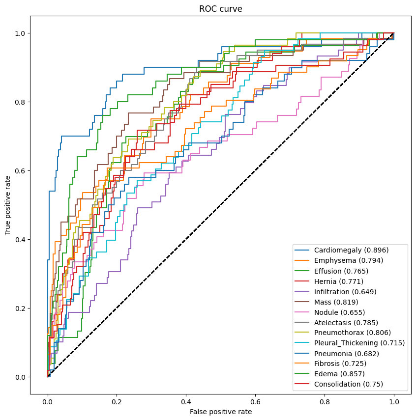
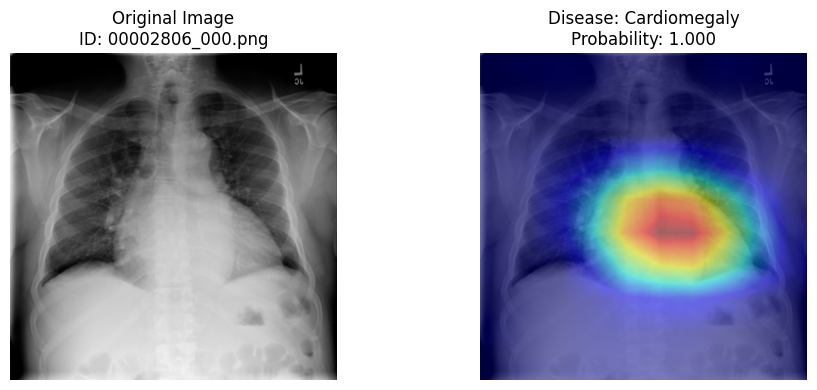
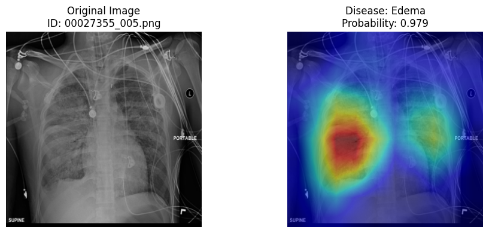
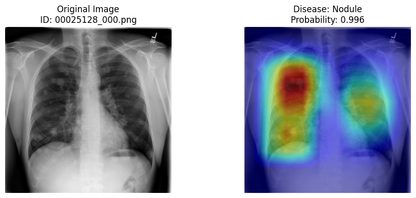
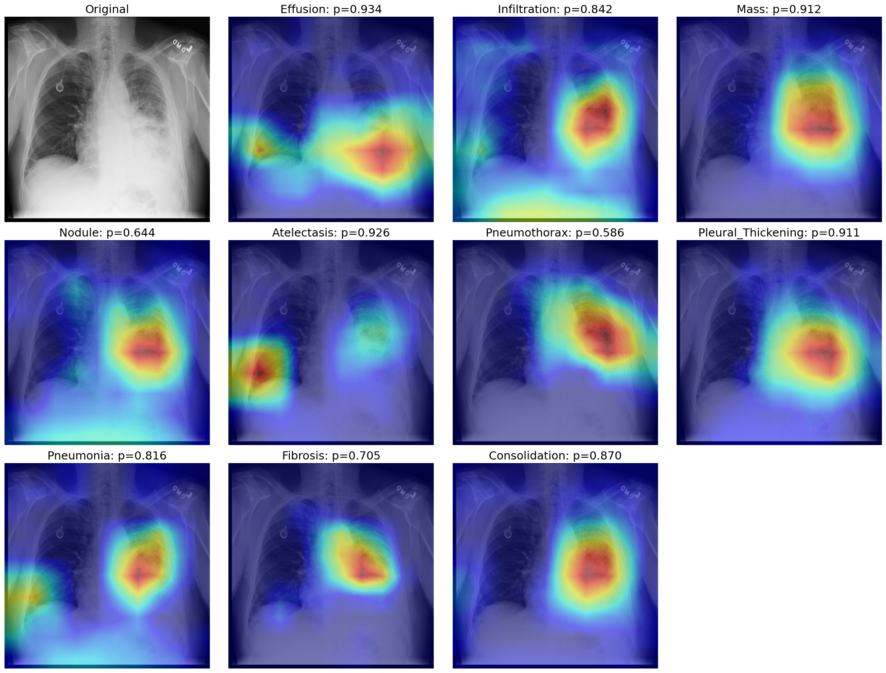

  

# Explainability Analysis of Multi-label Thoracic Disease Predictions from Chest X-ray Images Using Pretrained DenseNet21 Model and Grad-CAM

### Project Overview

Deep learning models have achieved remarkable performance in medical image analysis, yet their predictions are often difficult to interpret because convolutional neural networks operate as black-box models. In clinical applications, understanding *why* a model predicts a particular disease is as important as obtaining accurate predictions. This project presents an Explainable AI workflow that combines a **pretrained DenseNet121** model with **Gradient-weighted Class Activation Mapping (Grad-CAM)** to investigate model attention for **fourteen thoracic diseases** in chest X-ray images. Rather than developing a new classification model, this study focuses on improving the transparency of an existing validated model through qualitative explainability analysis. The notebook demonstrates image preprocessing, probability prediction, ROC evaluation, Grad-CAM visualization, and interpretation for both single-disease and multi-label prediction scenarios.

### Key Highlights

| Feature | Description |
|----------|-------------|
| 🩻 Medical Imaging | Chest X-ray Analysis |
| 🧠 Deep Learning Model | Pretrained DenseNet121 |
| 🔍 Explainability | Gradient-weighted Class Activation Mapping (Grad-CAM) |
| 📊 Classification Task | Multi-label Classification |
| 🏥 Disease Categories | 14 Thoracic Diseases |
| 🖼 Dataset | NIH ChestX-ray14 |
| 📂 Images Used | Curated subset of 1,000 chest X-ray images |
| 🐍 Framework | TensorFlow / Keras |

### Study Workflow

### Dataset

This project utilizes the **NIH ChestX-ray14** dataset introduced by Wang et al. (2017). The complete dataset contains more than **100,000 frontal chest radiographs** collected from over **30,000 patients**, with each image annotated using up to **14 thoracic disease labels**. For this explainability study, a curated subset of **1,000 chest X-ray images** was used to enable efficient experimentation while preserving the multi-label characteristics of the original dataset.

| Attribute | Description |
|------------|-------------|
| Dataset | NIH ChestX-ray14 |
| Images | 112,120 |
| Patients | 30,805 |
| Disease Labels | 14 thoracic diseases |
| Images Used | curated subset of over 1,000 |

**Dataset Resources**
- Original paper : [ChestX-ray8: Hospital-scale Chest X-ray Database and Benchmarks](https://arxiv.org/abs/1705.02315)
- NIH clinical center, US research hospital, ChestX-ray14 dataset: https://nihcc.app.box.com/v/ChestXray-NIHCC
- Curated dataset used in this notebook: https://drive.google.com/file/d/1U23OnS30DkPxR4rPTXf2Msul7AJMc7A5/view

### Results

The pretrained DenseNet121 model demonstrated discriminative capability across all fourteen thoracic disease categories. Performance was evaluated using Receiver Operating Characteristic (ROC) curves and the Area Under the Curve (AUC).

### Grad-CAM Gallery

Subsequently, Grad-CAM was employed to visualize image regions contributing to the model's predictions

#### Single Disease Prediction

In single disease prediction, Grad-CAM highlights the image regions that contribute the strongest to individual disease predictions.

---

#### Multi-label Disease Prediction

For multi-label chest X-ray images, Grad-CAM is generated independently for each predicted disease, illustrating how model attention shifts across different thoracic abnormalities within the same radiograph.

### Requirements
- Python
- TensorFlow
- Keras
- NumPy
- Pandas
- Matplotlib
- OpenCV
- Scikit-learn
- Google Colab

### Acknowledgements

The pretrained DenseNet121 model and pretrained weights used in this project were obtained from the **AI for Medicine Specialization** developed by **DeepLearning.AI**. This repository does not claim authorship of the pretrained model. Instead, the model is employed as a validated inference engine to investigate Explainable Artificial Intelligence using Grad-CAM. The contribution of this project includes workflow design,  model implementation, visualization, and explainability analysis.

### References

- Wang, X., et al. (2017). ChestX-ray8: Hospital-scale Chest X-ray Database and Benchmarks on Weakly Supervised Classification and Localization of Common Thorax Diseases.
- Huang, G., et al. (2017). Densely Connected Convolutional Networks.
- Selvaraju, R. R., et al. (2020). Grad-CAM: Visual Explanations from Deep Networks via Gradient-based Localization.
- Tjoa, E., & Guan, C. (2020). A Survey on Explainable Artificial Intelligence (XAI): Toward Medical XAI.

### Assets
* Research notebook → [Open notebook](https://colab.research.google.com/drive/1p_p3vt6jaUPM4GAREIWQJ9SGu0uhDFP6?usp=sharing) 
